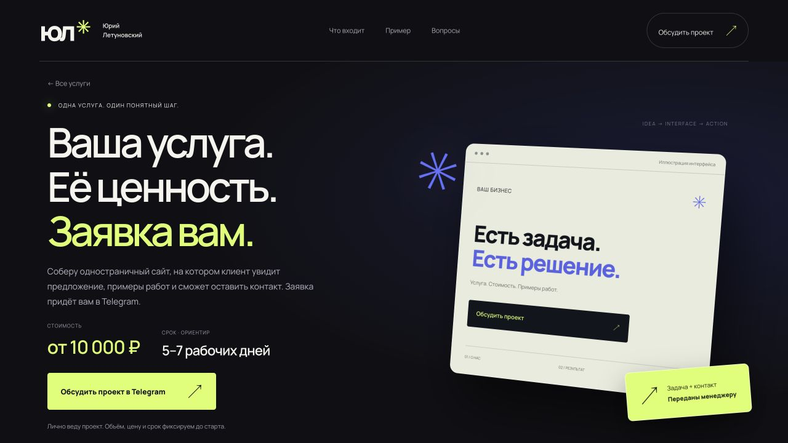

  <a href="https://yuriy-letunovskiy.pages.dev"><b>Сайт и услуги ↗</b></a>
  &nbsp; · &nbsp;
  <a href="https://t.me/neon_voicick"><b>Обсудить проект в Telegram ↗</b></a>

## Привет, я Юрий

Разрабатываю сайты для бизнеса, мобильные PWA и интеграции с Telegram. Мне интересен весь путь: от структуры и визуальной идеи до работающей формы и проверки на телефоне.

**МГТУ им. Н. Э. Баумана · ИУ7 · Программная инженерия · 2-й курс.**

### Что делаю

- **Сайты и лендинги:** предложение, услуги, примеры работ, адаптивный интерфейс и заявки.
- **PWA:** мобильные сценарии, добавление на главный экран, работа с локальным состоянием.
- **Telegram:** серверная доставка обращений и сценарии сбора вводных.
- **Интерактив:** Three.js, анимации и учёт настройки уменьшенного движения.

`JavaScript` · `HTML / CSS` · `Three.js` · `PWA / Service Worker` · `Cloudflare Workers` · `Telegram Bot API`

## Избранные проекты

### 01 / Личный сайт разработчика

**Опубликованный личный проект.** 3D-сцена, отдельные страницы услуг, адаптивная вёрстка и форма с серверной отправкой в Telegram. Валидация, Turnstile и подтверждение доставки; события Яндекс Метрики для обращений.

[Открыть сайт ↗](https://yuriy-letunovskiy.pages.dev) · [Подробнее о реализации](./studio.md)

<table>
<tr>
<td width="50%" valign="top">
<h3>02 / Grooming PWA</h3>

<b>Демонстрационный проект.</b> Выбор питомца и нескольких услуг, суммарная длительность, календарь на две недели, проверка непрерывного свободного интервала.

<a href="https://maket-grooming-yura.pages.dev">Открыть демо ↗</a> · <a href="./grooming.md">Разбор проекта</a>

</td>
<td width="50%" valign="top">
<h3>03 / Detailing PWA</h3>

<b>Демонстрационный проект.</b> Каталог услуг, выбор времени с учётом длительности, форма, сохранённые демозаписи и отмена. Тёмный мобильный интерфейс.

<a href="https://maket-detailing-yura.pages.dev">Открыть демо ↗</a> · <a href="./detailing.md">Разбор проекта</a>

</td>
</tr>
</table>

> В PWA-демо данные сохраняются в браузере. Реальные салоны, серверное бронирование и платежи не подключены. Иллюстрации созданы для макетов.

## Как подхожу к работе

**Задача → структура → интерфейс → реализация → проверка → запуск.**

Заранее согласую состав работ. Проверяю не только внешний вид, но и ошибки формы, повторную отправку и мобильные сценарии. Секреты интеграций храню на сервере.

Референсы и открытые проекты

Подборка чужих открытых проектов для изучения визуальных и технических решений — с авторами и ссылками. Они не входят в список моих разработок.

[Открыть подборку →](./REFERENCES.md)

---

**Есть задача для сайта или приложения?** [Напишите в Telegram](https://t.me/neon_voicick) — обсудим сценарий, объём и сроки.
